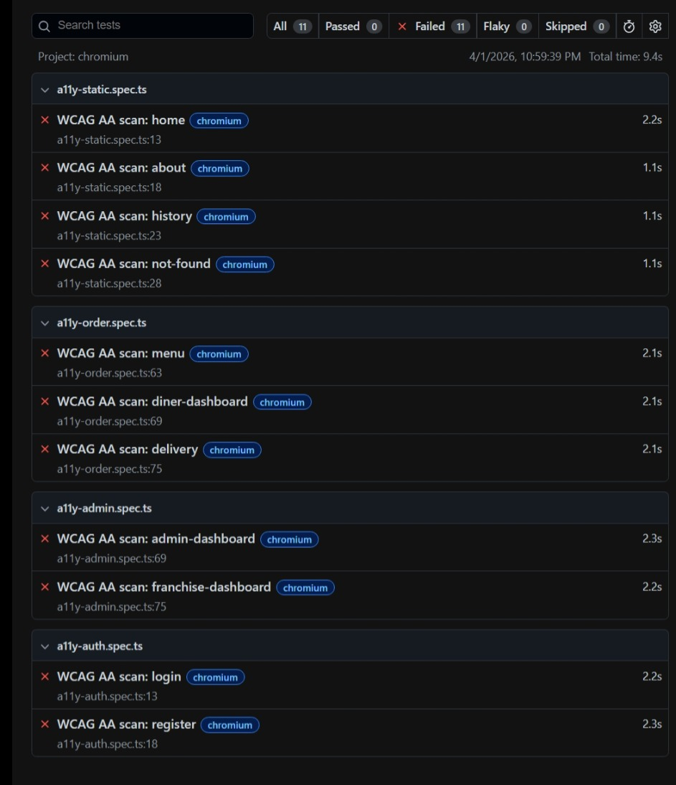
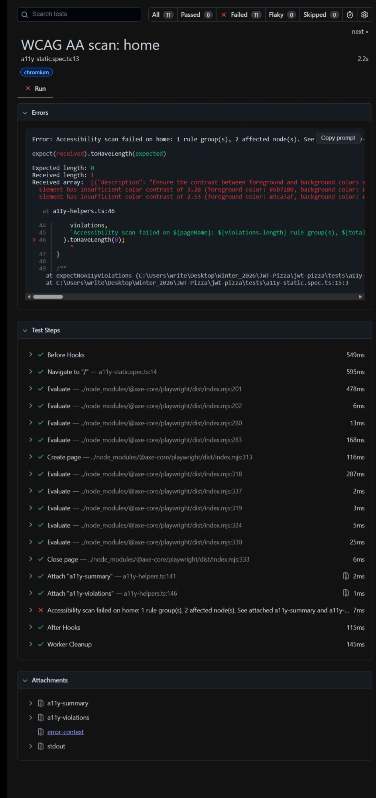

# Intro

Accessibility testing was briefly mentioned in the "testingCategories" reading for this course, and I have a passion for creating accessible websites that adhere to accessibility standards. Playwright provides some basic libraries of testing for these standards, which give an easy way to implement testing that will check for the various benchmarks. Playwright documentation gives these as an example:

- Text that would be hard to read for users with vision impairments due to poor color contrast with the background behind it
- UI controls and form elements without labels that a screen reader could identify
- Interactive elements with duplicate IDs which can confuse assistive technologies

# Why Accessibility Matters

Website accessibility (sometimes abbreviated in development as "a11y") is important not only to ensure equal access for the non-insignificant number of users on the internet with disabilites affecting their website usage, but also to provide a better UX experience for everyone. It has been studied and proven that when websites are developed to meet high accessibility standards, it improves the user experience for non-disabled ussers. In addition, many types of companies are required by law to meet certain standards for accessibility. Overall, accessibity greatly improves the design of software and websites through a easily measured set of standards. With the rise of AI coding agents, there are even more opportunities to provide a good web experience to disabled users.

# Accessibility Levels

The primary accessbility standard are the [Web Content Accessibility Guidelines](https://www.w3.org/TR/WCAG22/) (WCAG) published by the [World Wide Web Consortium](https://www.w3.org/) (W3C) that measure based on four principles; Perceivable, Operable, Understandable, and Robust. To measure the amount of adherence and coverage of the guidelines, there are three levels of conformance that are provided:

1. Level A (minimum) - basic accessibility features that remove the most significant barriers, but don't guarantee full access
1. Level AA (standard) - industry standard and common legal requirement, covers common barriers for users with disabilities
1. Level AAA (highest) - most comprehensive and strict adherence to guidelines, providing highest level of accessibility

# Playwright Features

Here are the following features that Playwright provides as tools to measure how a website meets accessibility standards. Find the full details [here](https://playwright.dev/docs/accessibility-testing).

| Feature                          | Description                                                                                                                                                                               |
| -------------------------------- | ----------------------------------------------------------------------------------------------------------------------------------------------------------------------------------------- |
| Scanning an entire page          | Import @axe-core/playwright package and apply it in a test to scan an entire page for any accessibility violations to be found                                                            |
| Scanning specific part of a page | Use the AxeBuilder class to constrain an accessbility scan to run against a specific portion of a page in its current state                                                               |
| Scan for WCAG violations         | You can constrain a scan to only those ruls tagged for specific WCAG success criteria, such as only (A) or (AA) standards                                                                 |
| Known issue handling             | There are various ways to exclude individual elements, certain standards, or otherwise known issues from a scan so that they can be worked on separately without interrupting the testing |

# My Implementation

### Step 1: Setup

1. Install the testing library in the jwt-pizza directory
   `npm install --save-dev @axe-core/playwright`
1. Verify installation by checking for the @axe-core/playwright package in package.json under devDependencies

### Step 2: Accessibility Test Helpers

Using a coding assitant, I did the following:

1. Created `tests/a11y-helpers.ts` utility file with reusable functions:
   - `scanPageA11y()` - scans entire page for WCAG AA violations
   - `expectNoA11yViolations()` - assertion to fail tests on violations
   - `scanElementA11y()` - scans specific element for violations
   - `logA11yViolations()` - outputs detailed violation reports

2. Implemented using `AxeBuilder` class from `@axe-core/playwright`:
   - `new AxeBuilder({ page })` initializes a scan builder for a Playwright page
   - `.withTags(['wcag2aa'])` filters results to WCAG 2.2 AA level only
   - `.include([selector])` restricts scan to a specific element
   - `.analyze()` executes the scan and returns violations and passes

3. Each function calls `analyze()` to run the scan and extracts violations from results

### Step 3: Check Current Coverage

As described in the course material, the "Lighthouse" feature of Chrome devTools can be used to get a usability score. Here are the scores for each of the pages in the website, with relevant findings.

| Page                                        | Score | Issues                                                           |
| ------------------------------------------- | ----- | ---------------------------------------------------------------- |
| `/` (home)                                  | 86    | img alt attributes, link names, color contrast                   |
| `/login`                                    | 85    | button names, img alt attributes, color contrast                 |
| `/menu`                                     | 85    | img alt attributes, form elements without labels, color contrast |
| `/payment`, `/delivery`, `/diner-dashboard` | 90    | img alt attributes, color contrast                               |
| `/about`, `/history`, `/docs`               | 90    | img alt attributes, color contrast                               |
| admin & franchise pages                     | 90    | img alt attributes, color contrast                               |

### Step 4: Create Accessibility Test Suite

Created four test files covering all the jwt-pizza site pages. Each test is now named as a neutral WCAG AA scan, navigates to a page, runs the helper assertion, and fails when violations are found. The helper also attaches violation artifacts to the Playwright report (`a11y-summary` and `a11y-violations`).

| File                        | Pages Covered                              |
| --------------------------- | ------------------------------------------ |
| `tests/a11y-static.spec.ts` | `/`, `/about`, `/history`, 404             |
| `tests/a11y-auth.spec.ts`   | `/login`, `/register`                      |
| `tests/a11y-order.spec.ts`  | `/menu`, `/diner-dashboard`, `/delivery`   |
| `tests/a11y-admin.spec.ts`  | `/admin-dashboard`, `/franchise-dashboard` |

Example test from `a11y-static.spec.ts`:

```ts
test("WCAG AA scan: home", async ({ page }) => {
  await page.goto("/");
  await expectNoA11yViolations(page, test.info(), "home");
});
```

This test navigates to the home page, scans it for WCAG AA violations using AxeBuilder, prints any violations to the console for debugging, then fails if any are found. All other tests in the suite follow this same pattern.

### Step 5: Run Tests & Analyze Results

Running the tests can be accomplished by using the following command in the jwt-pizza directory (insert a call to each of the test files to run):
`npx playwright test tests/[test file name].spec.ts tests/[test file name].spec.ts`

After the tests run, open the Playwright HTML report and inspect each failed test’s attachments to identify exact rule IDs and affected nodes for fixing.
`npx playwright show-report`

Summary Page: 

Example Violation Finding: 

### Step 6: Fix Violations

Now that I've found all the violations that need to be fixed to meet AA standards, I can plan how to fix those in the codebase. Most of these fixes are similar and pretty minimal changes to the pages, so we can easily bring jwt-pizza up to standards.

### Step 7: CI Integration

# Conclusion
